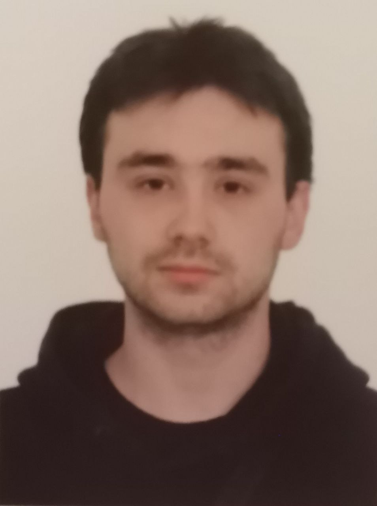

# Antonovich Yakov Vasilievich


**Phone number:**  
+375(29)721-81-81  

**Email address:**  
accurot.work@gmail.com  

**Location:**  
Belarus, Brest city  

## Personal information

| Category         | Details                  |
|------------------|--------------------------|
| Citizenship:     | Republic of Belarus      |
| Education:       | Secondary-specialized    |
| Gender:          | Male                     |
| Date of Birth:   | 22 November 1997         |
| Marital status:  | Not married              |

## Education
- **Volkovysk State Agrarian College:**  
  2015-2018 Veterinary medical assistant

## Languages
- **Russian:** native speaker
- **English level:** A1  

## Skills

- HTML
- CSS
- JavaScript (Basics)
- Git/GitHub
- Ability to defend your position
- Love of problem solving
- Passion for learning new things
- Adaptation to changing conditions
- Ability to take criticism

## Code example

```
function maps(arr){
  let newArr = [];

  for (let elem of arr) {
     elem += elem;
     newArr.push(elem);
  }
  return newArr;
}
```

## Hobbies

- Sport
- Reading books
- Video games